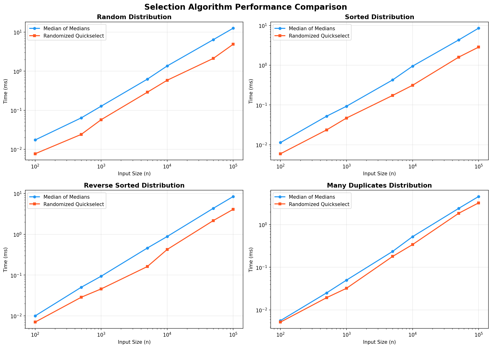

# Assignment 6: Medians and Order Statistics & Elementary Data Structures

**Author:** Aashish Sapkota  
**Professor:** Michael Solomon  
**Course:** Algorithms and Data Structures (MSCS-532-M80)  
**University of the Cumberlands**  
**Date:** March 14, 2026

---

## Part 1: Implementation and Analysis of Selection Algorithms

### 1.1 Algorithm Descriptions

#### Deterministic Selection: Median of Medians

The Median of Medians (MoM) algorithm guarantees worst-case O(n) time for selecting the k-th smallest element. The algorithm operates as follows: (1) divide the input array into groups of five elements, (2) find the median of each group by sorting, (3) recursively compute the median of these medians to use as a pivot, (4) partition the array around this pivot using three-way partitioning (low, equal, high), and (5) recurse into the appropriate partition based on the position of k relative to the partition boundaries.

The key insight is that the chosen pivot is guaranteed to eliminate at least 30% of the elements in each recursive call. At least 3 out of every 10 elements are guaranteed to be either larger or smaller than the pivot. This guarantee yields the worst-case recurrence T(n) = T(n/5) + T(7n/10) + O(n), which solves to T(n) = O(n) because 1/5 + 7/10 = 9/10 < 1.

#### Randomized Quickselect

Randomized Quickselect selects a uniformly random pivot, partitions the array around it using three-way partitioning for duplicate handling, and recurses into the partition containing the k-th element. While the worst case is O(n²) when every chosen pivot is extreme, the expected running time is O(n) because a randomly chosen pivot produces a reasonably balanced partition with constant probability.

Formally, since a random pivot lands in the middle half with probability 1/2, the expected subproblem size is at most 3n/4, giving E[T(n)] = O(n). The three-way partitioning is critical for correctness: without it, arrays containing all identical values would cause infinite recursion in a naive two-way partition scheme.

### 1.2 Implementation Details

Both algorithms were implemented in Python with the following design decisions:

- **Three-way partitioning** separates elements into low (< pivot), equal (= pivot), and high (> pivot) groups, handling duplicate elements correctly and efficiently.
- **Base cases** handle small arrays (n ≤ 5 for MoM, n = 1 for Quickselect) by sorting or direct return.
- **Input validation** raises ValueError for empty arrays or out-of-range k values.
- **1-based k** (k=1 returns the minimum) for intuitive usage.

The implementation was verified with 8 test cases covering edge cases including single-element arrays, all-duplicate arrays, sorted and reverse-sorted inputs, and median selection on larger arrays. All tests passed successfully:

_Figure 1: Verification tests — all 8 test cases pass for both Median of Medians and Randomized Quickselect._

### 1.3 Time Complexity Analysis

| Algorithm              | Best Case | Expected | Worst Case |
| ---------------------- | --------- | -------- | ---------- |
| Median of Medians      | O(n)      | O(n)     | O(n)       |
| Randomized Quickselect | O(n)      | O(n)     | O(n²)      |

#### Why Median of Medians Achieves O(n) Worst Case

The pivot selection in MoM ensures that at least 3n/10 − 6 elements are less than the pivot and at least 3n/10 − 6 are greater. This means the recursive call on the larger partition processes at most 7n/10 + 6 elements. Combined with the O(n) work for partitioning and the T(n/5) call for finding the median of medians, the recurrence T(n) ≤ T(n/5) + T(7n/10) + cn solves to O(n) because the combined fraction 1/5 + 7/10 = 9/10 < 1, ensuring the total work across all levels forms a convergent geometric series.

#### Why Randomized Quickselect Achieves O(n) in Expectation

A uniformly random pivot falls in the "middle half" (between the 25th and 75th percentiles) with probability at least 1/2. When this occurs, the subproblem size shrinks to at most 3n/4. The expected number of rounds before a good pivot is chosen is 2 (geometric distribution), so the expected total work is n + 3n/4 + 9n/16 + ... = O(n). The O(n²) worst case occurs only if every pivot is maximally unbalanced, which has vanishingly small probability.

#### Space Complexity

Both algorithms use O(n) auxiliary space in this implementation because each recursive call creates new lists for the low, equal, and high partitions. The Median of Medians algorithm additionally allocates a medians list of size n/5 at each level. An in-place variant of Quickselect can reduce space to O(log n) expected for the recursion stack, but MoM inherently requires O(n) space due to the medians sub-array construction.

### 1.4 Empirical Analysis

Both algorithms were benchmarked on input sizes from 100 to 100,000 across four distributions: random, sorted, reverse-sorted, and arrays with many duplicate values. Each measurement was averaged over 5 trials to reduce variance. The median element (k = n/2) was selected in all tests.

_Figure 2: Empirical benchmark results — timing table across all four distributions on macOS (Apple M5 Pro)._

The results were also plotted on log-log axes to visualize the linear scaling behavior:

_Figure 3: Log-log performance comparison — both algorithms exhibit linear scaling across all distributions._

#### Key Observations

1. **Randomized Quickselect is consistently 1.5–3x faster** than Median of Medians across all distributions. The overhead of computing medians of groups of five and recursing on the medians array makes MoM slower in practice despite its superior worst-case guarantee.
2. **Both algorithms exhibit clear linear scaling** on the log-log plots, confirming the O(n) theoretical analysis for both expected (RQS) and worst-case (MoM) time complexity.
3. **The performance gap narrows on the "Many Duplicates" distribution** (ratio ≈1.1–1.6), because three-way partitioning eliminates large chunks of equal elements efficiently in both algorithms, reducing the effective recursion depth.
4. **No pathological O(n²) behavior was observed** for Randomized Quickselect on any tested distribution, illustrating that the worst case is exceedingly unlikely in practice with a uniform random pivot.

---

## Part 2: Elementary Data Structures Implementation and Discussion

### 2.1 Implementation Summary

All data structures were implemented from scratch in Python without relying on built-in collection abstractions. Each implementation includes comprehensive docstrings, edge case handling, and `__repr__` methods for debugging.

#### Dynamic Array

A resizable array that doubles capacity when full and halves when only a quarter is occupied. This amortized resizing strategy ensures that the average cost of append operations is O(1). Insertion and deletion at arbitrary indices require shifting elements and are O(n) in the worst case. The search operation performs a linear scan and is also O(n).

#### Matrix (2D Array)

A 2D matrix implemented using a flat (1D) array with row-major indexing: index = row × cols + col. This provides O(1) element access with better cache locality compared to a list-of-lists approach, which is important for performance in numerical applications.

#### Stack (Array-Based)

A Last-In-First-Out (LIFO) stack implemented using a dynamic list as the backing store. Push and pop both operate on the end of the list, achieving O(1) amortized time. Peek returns the top element without modification in O(1).

#### Queue (Circular Buffer)

A First-In-First-Out (FIFO) queue using a circular buffer to achieve O(1) enqueue and dequeue without element shifting. A front pointer tracks the head, and elements wrap around the end of the array using modular arithmetic. The buffer resizes dynamically with the same doubling/halving strategy as the Dynamic Array.

#### Singly Linked List

Supports O(1) insertion at the head and O(n) insertion at the tail, deletion by value, search, and full traversal. Each node uses `__slots__` for memory efficiency. Unlike arrays, linked lists do not require contiguous memory, but sacrifice O(1) random access.

#### Rooted Tree (Bonus)

A general rooted tree where each node maintains a list of children. Both depth-first (DFS) and breadth-first (BFS) traversals are provided, each running in O(n) time. This structure models hierarchical relationships such as organizational charts, file systems, and DOM trees.

All data structures were tested with demonstration operations:

_Figure 4: Data structures demonstration — all six data structures executing correctly on macOS (Apple M5 Pro)._

### 2.2 Performance Analysis

| Structure     | Access     | Insert Head | Insert End  | Delete   | Search |
| ------------- | ---------- | ----------- | ----------- | -------- | ------ |
| Dynamic Array | O(1)       | O(n)        | O(1)\*      | O(n)     | O(n)   |
| Stack         | O(1) top   | N/A         | O(1)\* push | O(1) pop | O(n)   |
| Queue         | O(1) front | N/A         | O(1)\* enq  | O(1) deq | O(n)   |
| Linked List   | O(n)       | O(1)        | O(n)        | O(n)     | O(n)   |
| Rooted Tree   | O(n)       | O(1) child  | O(1) child  | O(n)     | O(n)   |

\*Amortized due to dynamic resizing.

### 2.3 Trade-offs: Arrays vs. Linked Lists

Arrays provide O(1) random access and excellent cache performance due to contiguous memory layout, making them the default choice for stacks and queues where operations happen at the ends. Linked lists excel when frequent insertions or deletions occur at the head or at arbitrary positions, because they avoid the O(n) element-shifting cost of arrays. However, linked lists incur per-node memory overhead (the next pointer) and poor cache locality due to scattered heap allocations.

For stacks, an array-based implementation is nearly always preferred because push and pop operate at the end of the array with O(1) amortized cost and no wasted pointer storage. For queues, a naive array implementation would require O(n) dequeue due to shifting; the circular buffer solves this while retaining contiguous memory. A linked-list-based queue achieves O(1) enqueue and dequeue naturally but at the cost of pointer overhead and cache misses, making it slower in practice for most workloads.

### 2.4 Practical Applications

- **Dynamic Arrays** are the foundation of virtually all high-level language list types (Python lists, Java ArrayLists, C++ vectors). They are used wherever random access and sequential iteration are needed: database result sets, image pixel buffers, and application state management.
- **Stacks** are central to function call management (the call stack), expression evaluation (postfix calculators), syntax parsing (bracket matching), undo/redo systems, and depth-first graph traversal.
- **Queues** power task scheduling in operating systems, breadth-first search, print job spooling, message passing in distributed systems, and HTTP request buffering in web servers.
- **Linked Lists** are used in memory allocators (free lists), hash table chaining for collision resolution, LRU caches (doubly linked), and any scenario where elements are frequently inserted or removed from the middle of a collection.
- **Rooted Trees** model hierarchical data: file systems, organizational charts, DOM trees in web browsers, abstract syntax trees in compilers, and decision trees in machine learning.

---

## Conclusion

This assignment demonstrated both theoretical analysis and practical implementation of selection algorithms and elementary data structures. The Median of Medians algorithm provides a valuable worst-case O(n) guarantee that is important for adversarial or security-sensitive contexts, while Randomized Quickselect is the practical choice for general-purpose selection due to its lower constant factor and simpler implementation. Empirical benchmarks confirmed the theoretical predictions: both algorithms scale linearly, with Quickselect running 1.5–3x faster across all tested distributions.

For data structures, the choice between arrays and linked lists depends fundamentally on the access pattern. Arrays dominate when random access and cache performance matter, and the circular buffer design elegantly solves the queue dequeue problem without sacrificing contiguous memory. Linked lists remain the right choice when frequent head insertions or mid-collection modifications are required, and trees extend the linked-node concept to model the hierarchical relationships that pervade computing. Understanding these trade-offs is fundamental to designing efficient, scalable software systems.

---

## References

1. Cormen, T. H., Leiserson, C. E., Rivest, R. L., & Stein, C. (2022). _Introduction to Algorithms_ (4th ed.). MIT Press. Chapters 9 (Medians and Order Statistics) and 10 (Elementary Data Structures).
2. Blum, M., Floyd, R. W., Pratt, V., Rivest, R. L., & Tarjan, R. E. (1973). Time bounds for selection. _Journal of Computer and System Sciences_, 7(4), 448–461.
3. Hoare, C. A. R. (1961). Algorithm 65: Find. _Communications of the ACM_, 4(7), 321–322.
